---
authors:
  - Drahoxx
title: "CSAWCTF2024-Qualifiers - Writeups OSINT"
description: "Parcours complet des challenges OSINT CSAWCTF 2024 : recherches ouvertes, plaques diplomatiques, suivi d'avion, caractères invisibles et pistes musicales."
publicationDate: 2024-09-11 00:00:00+0000
cover: ../../../assets/blog/csaw2024-qualifiers-osint/csaw.png
coverAlt: "CSAWCTF2024-Qualifiers OSINT"
categories:
  - OSINT
tags:
  - CSAWCTF
  - CTF
  - OSINT
---

## Authentic Chinese Food

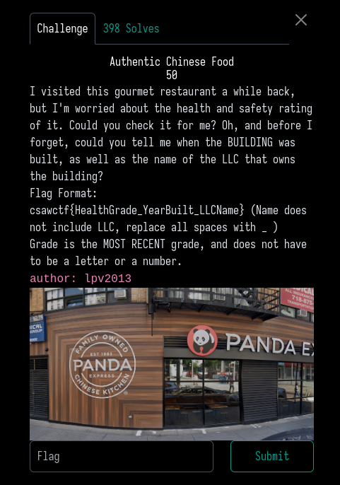

Dans le coin supérieur droit de l'image, nous pouvons voir un numéro de téléphone. Après une recherche Google rapide, nous comprenons que le numéro vient de New York.

Nous pouvons ensuite chercher "Panda Express New York" sur Google Maps et trouver celui qui correspond à l'image ci-dessus.

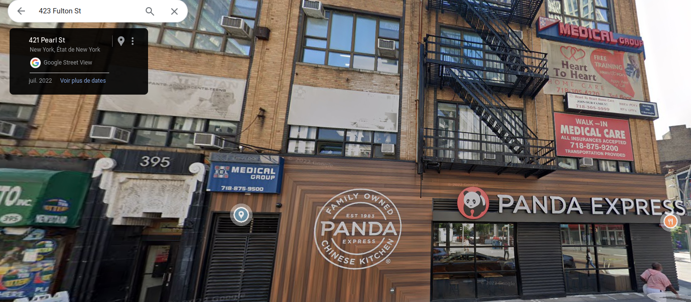

Son adresse est : 423 Fulton St, Brooklyn, NY 11201

### Healthgrade

Sur ce site, si nous saisissons l'adresse du restaurant, nous pouvons voir que sa note indique pending ; il s'avère que c'était la première partie du flag :

https://a816-health.nyc.gov/ABCEatsRestaurants/#!/Search/50055636

### Année de construction

Sur certains sites, il est indiqué que le bâtiment a été construit en 1920, mais si nous consultons cet article à propos de ce bâtiment précis, il indique qu'il a été construit en 1931 :
https://www.brownstoner.com/architecture/building-of-the-day-423-fulton-street/

### Nom de la LLC

Sur plusieurs sites immobiliers, en saisissant cette adresse, nous pouvons voir qu'elle appartient à BNN FULTON FLUSHING OWNER LCC
https://a836-pts-access.nyc.gov/care/datalets/datalet.aspx?mode=asmt_tent_2027&UseSearch=no&pin=3001500011&taxyr=2027&LMparent=20

### Flag

```
csawctf{Pending_1931_Bnn_Fulton_Flushing_Owner}
```


## Rickshaw

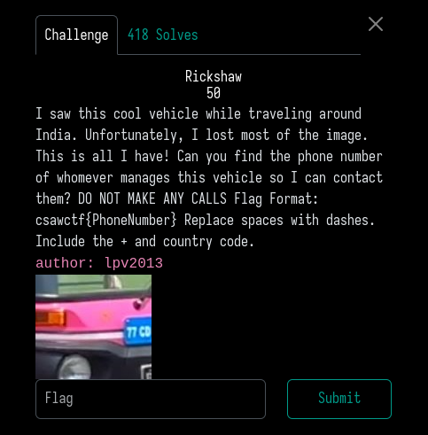

Pour ce challenge, nous devons trouver le numéro de téléphone du propriétaire de ce véhicule.
Après avoir cherché sur Google les quatre premiers caractères de cette plaque, nous comprenons que ce rickshaw appartient à l'ambassade des États-Unis en Inde

https://www.licenseplatemania.com/landenpaginas/indie.htm

Nous pouvons ensuite chercher "pink rickshaw US ambassy India" sur Google et trouver, dans les premiers résultats, ce post Facebook de l'ambassade des États-Unis en Inde :
https://www.facebook.com/India.usembassy/videos/the-auto-gang-of-the-us-embassy/839571310398639/

Nous allons ensuite sur le profil Facebook de l'ambassade et nous trouvons leur numéro de téléphone.

### Flag

```
csawctf{+91-11-2419-8000}  
```


## Plane spotting

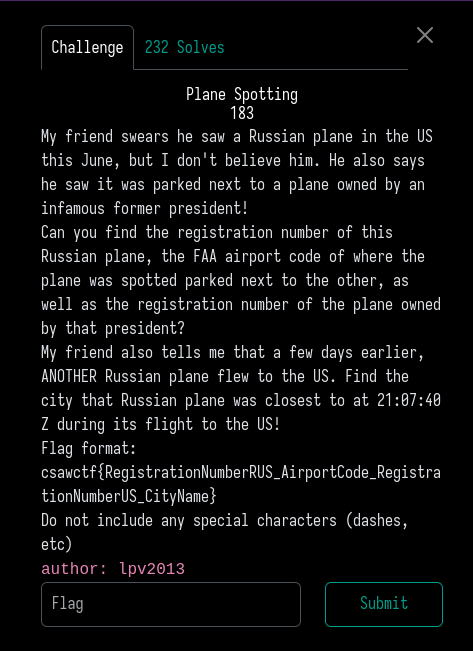

Une recherche Google sur cet incident nous mène à cet article :
https://www.donaldlovesvladimir.com/post/trump-plane-parked-next-to-russian-government-jet-at-dulles

### Numéro d'immatriculation US

Nous apprenons que l'ancien président est Donald Trump et que son avion est le 'Trump force one'. Une recherche Google nous donne son numéro d'immatriculation : N757AF, et nous pouvons aussi trouver facilement que le modèle de l'avion russe est IL-96-300.

### Code aéroport

Dans les articles ci-dessus, nous apprenons aussi que l'aéroport où l'avion de Trump était garé à côté de l'avion russe était Washington-Dulles, dont le code est : IAD

### Numéro d'immatriculation RUS

Après quelques recherches supplémentaires, nous recoupons l'avion russe et son numéro d'immatriculation :
https://zenn.dev/tkaliiho/articles/3018ddaddfa946

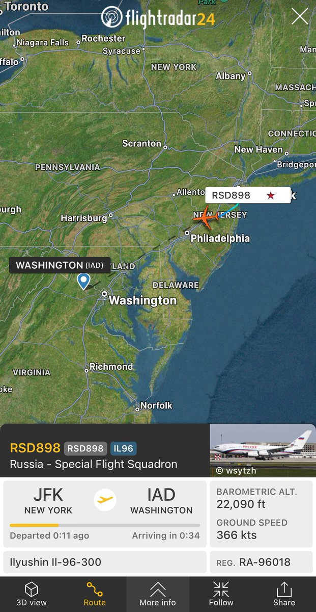

Le numéro d'immatriculation est RA-96018

### Nom de la ville américaine

Le challenge parle ensuite d'un autre avion russe ayant volé vers les États-Unis.

Après quelques recherches en ligne, j'ai trouvé ce tweet qui parlait d'un autre avion russe présent aux États-Unis au moment de l'incident :

https://x.com/MenchOsint/status/1806742133069738360?lang=sr

Son numéro d'immatriculation est RA-96019, soit un seul chiffre au-dessus du précédent.
Je décide de regarder son historique de vol :

https://fr.flightaware.com/live/flight/RA96019/history
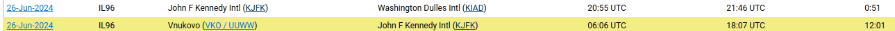

Cet avion volait aux États-Unis à 21:07, donc il semble que je sois sur la bonne piste ; regardons cela de plus près.
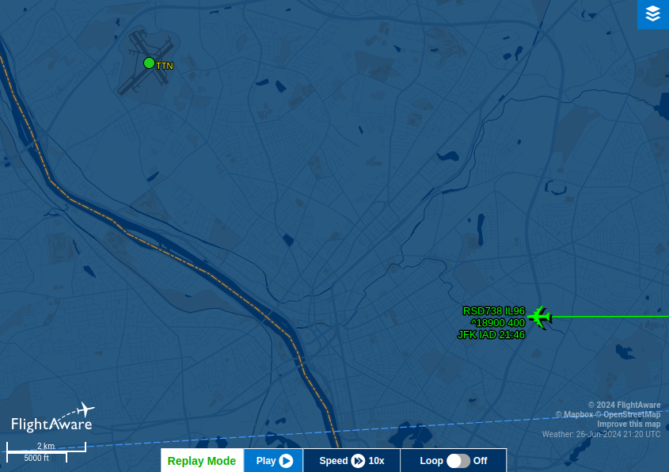

En regardant la position de l'avion sur Google Maps, nous voyons que la ville la plus proche est Trenton.

Nous combinons toutes ces informations et nous obtenons le flag !

### Flag

```
csawctf{RA96018_IAD_N757AF_Trenton}
```


## Literally 1984

C'était probablement le challenge OSINT le plus controversé de ce CTF ; personnellement, je l'ai beaucoup aimé et je l'ai trouvé assez original.

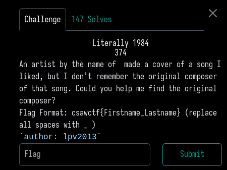

Nous n'avons pas beaucoup d'informations avec cette description, mais si nous regardons le code HTML du site, nous voyons quelque chose d'intéressant :

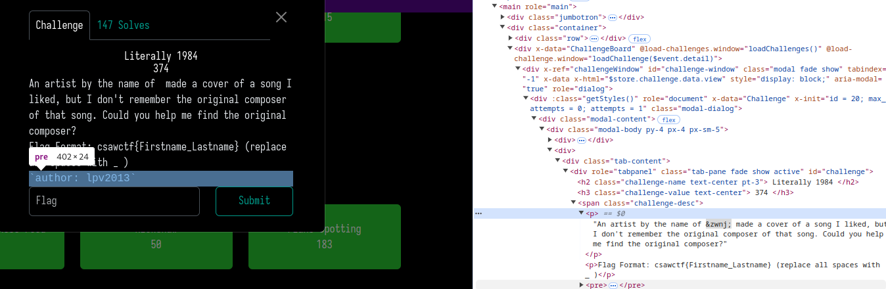

"&zwnj" est ce que nous voyons entre "name of" et "made a cover" dans le HTML.

Si nous cherchons cette séquence de caractères en ligne, cela nous amène à cette page wiki :
https://en.wikipedia.org/wiki/Zero-width_non-joiner

J'ai ensuite décidé de chercher sur YouTube du contenu lié au chant en utilisant cette séquence :
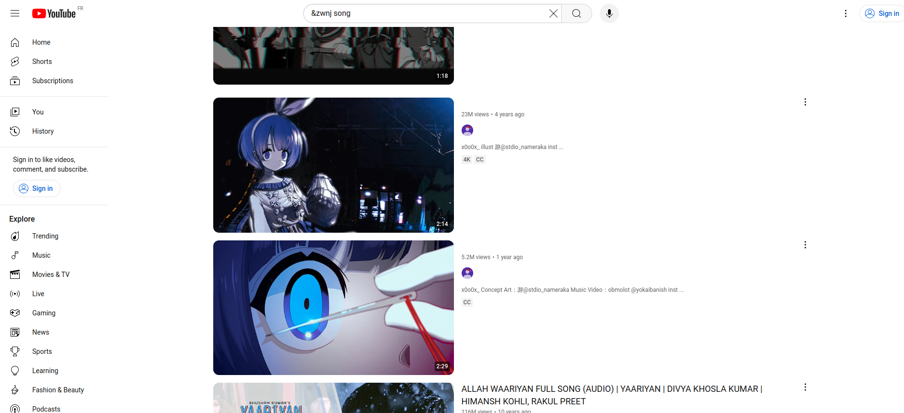
 
 Dans les premiers résultats, nous trouvons une chaîne de chant japonaise qui semble ne pas avoir de nom et utilise le pseudo x0o0x_ :
 

Dans les vidéos populaires de cette chaîne, nous voyons une chanson appelée big brother ; tout à coup, le nom du challenge prend beaucoup plus de sens.
https://www.youtube.com/watch?v=5lrseDtxX_E

Nous regardons ensuite le nom du compositeur dans la description de la vidéo et nous le traduisons en anglais, ce qui nous donne notre flag :

### Flag

```
csawctf{Susumu_Hirasawa}
```


## Mystery

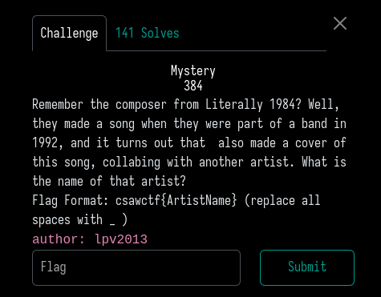

D'abord, nous devons regarder le groupe dont le producteur faisait partie en 1992. Après avoir consulté sa page Wikipedia, nous voyons que le groupe s'appelle P-model.

https://en.wikipedia.org/wiki/Susumu_Hirasawa

Après quelques recherches supplémentaires, nous voyons que le groupe n'a sorti qu'un seul album en 1992. J'ai donc cherché chaque chanson de cet album sur YouTube, suivie du nom de l'artiste du challenge précédent, x0o0x_

Nous trouvons alors rapidement cette chanson reprise par x0o0x_ et un autre artiste appelé Chogakusei.

https://www.youtube.com/watch?v=mI8KKipWEp4

### Flag

```
csawctf{Chogakusei}
```
